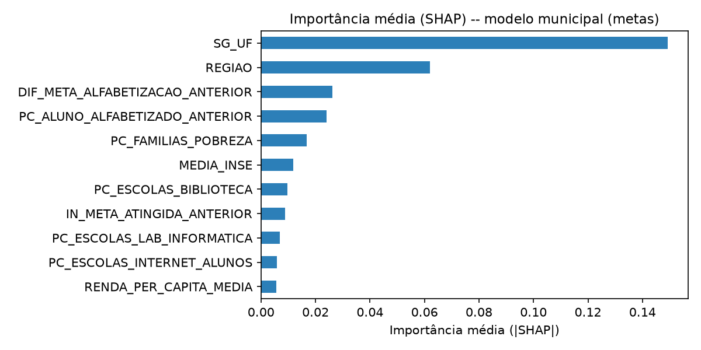
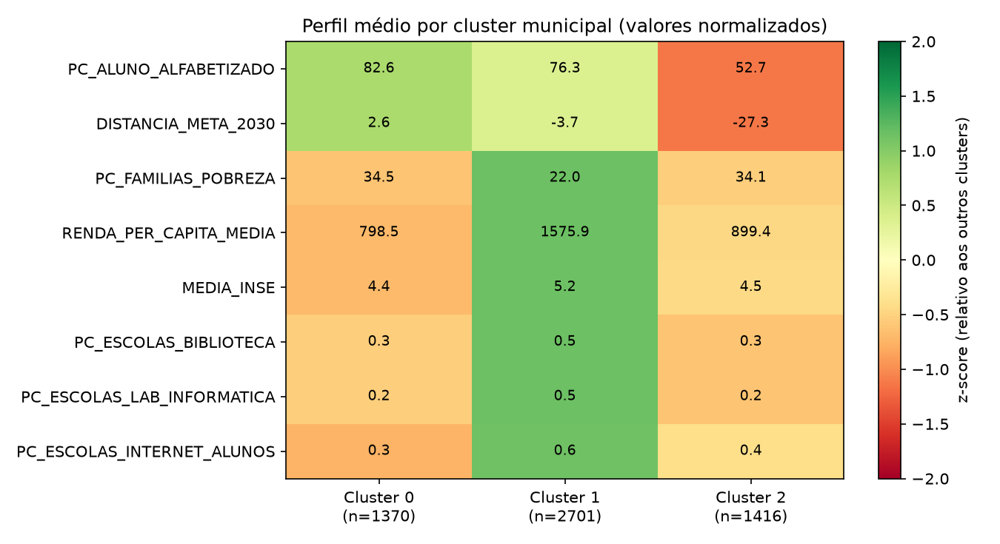
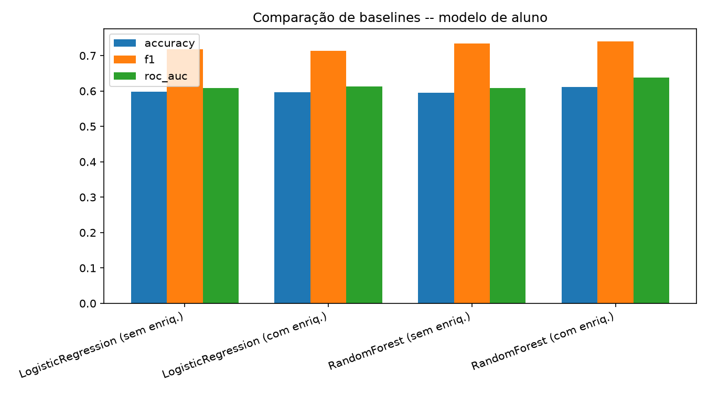
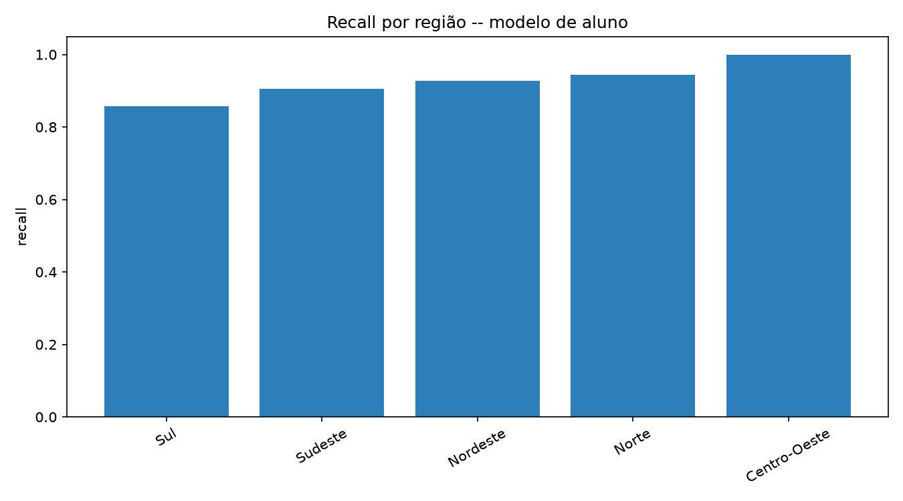
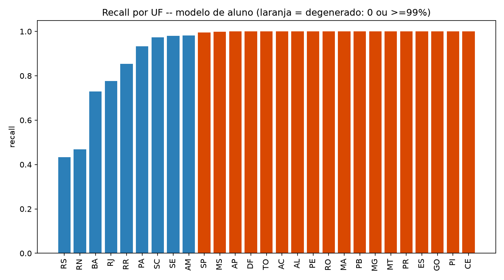
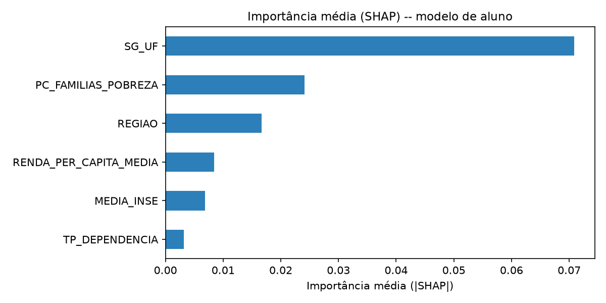

# Tech Challenge – Fase 3: Predição e Inteligência Analítica para Alfabetização no Brasil

## Contexto do problema

Alfabetizar toda criança até o final do 2º ano do Ensino Fundamental é meta
do Compromisso Nacional Criança Alfabetizada, mas o resultado varia
enormemente pelo território: neste estudo, a diferença entre a melhor e a
pior região chega a ~12 pontos percentuais (dado ponderado -- ver "Insights
encontrados"), e o SHAP (ver "Interpretação dos resultados") mostra que essa
desigualdade não está distribuída de forma difusa entre regiões, mas
concentrada em poucos estados específicos — um padrão que só se torna
visível quando a análise é conduzida na granularidade territorial correta.

Hoje o INEP só identifica quem não se alfabetizou **depois** da avaliação
anual — quando já é tarde para intervir naquele ano letivo. Este projeto
testa uma alternativa: estimar, a partir de indicadores territoriais,
socioeconômicos e do histórico recente de cada município, o risco de baixa
alfabetização com antecedência suficiente para viabilizar intervenção —
reforço escolar, merenda, transporte ou material didático direcionados de
forma proativa, não reativa. É uma arquitetura pensada para ser genuinamente
prospectiva e replicável para qualquer unidade federativa do país, à medida
que fontes administrativas mais tempestivas (CadÚnico, Censo Escolar) forem
incorporadas com a defasagem correta — ver "Limitações do projeto" para o
tratamento dado, nesta versão, às fontes cuja referência temporal é
contemporânea ou posterior ao ano avaliado.

## Objetivo analítico

Desenvolver uma arquitetura analítica supervisionada — replicável para
qualquer unidade federativa do país — capaz de identificar as variáveis
mais associadas à alfabetização infantil e de estimar, em diferentes
granularidades territoriais, o risco de municípios não atingirem suas
metas educacionais, subsidiando a priorização de políticas públicas de
reforço à alfabetização.

A investigação partiu de uma hipótese inicial mais ambiciosa — prever a
alfabetização de cada aluno individualmente — e evoluiu, à luz da evidência
empírica e das perguntas de negócio propostas pelo desafio (ver "Estratégia
do projeto" logo abaixo), para um conjunto de modelos na escala municipal:
a granularidade em que os dados públicos disponíveis efetivamente sustentam
inferência robusta e aplicação prática.

## Estratégia do projeto: perguntas de negócio

O Tech Challenge pede que o projeto responda perguntas de negócio, não
apenas produza métricas técnicas altas — o objetivo é gerar inteligência
aplicável ao contexto educacional brasileiro. Essa exigência acabou
definindo a arquitetura final do projeto, através de um percurso
investigativo genuíno, não de uma escolha arbitrária:

**Hipótese inicial** — construir um modelo capaz de prever a alfabetização
de cada aluno individualmente, a partir de variáveis educacionais,
territoriais e socioeconômicas (`FT_MACHINE_LEARNING`, seções técnicas
abaixo).

**Investigação** — a análise exploratória e a avaliação de importância de
features (SHAP) revelaram que as variáveis públicas disponíveis carregam
forte componente territorial e socioeconômico, mas quase nenhuma variação
em nível de aluno: 2,2 milhões de alunos colapsam em ~6.500 combinações
únicas de features, e o modelo, na prática, prevê perfis — não indivíduos
(ver "Limitações do projeto").

**Redefinição** — confrontado com as cinco perguntas de negócio do desafio,
ficou claro que quatro delas são intrinsecamente territoriais (risco por
município, padrões regionais, previsão de metas futuras, variáveis mais
influentes no modelo municipal). A unidade de análise capaz de responder ao
que estava sendo pedido não era o aluno — era o **município**.

**Estratégia final** — o modelo de aluno permanece documentado como etapa
exploratória, com valor científico próprio: evidencia os limites de
granularidade dos microdados públicos disponíveis. O entregável principal —
e a base das cinco respostas abaixo — é o conjunto de análises em nível de
**município** (`src/modeling/municipal_metas.py`, `municipal_clustering.py`,
`run_municipal_*.py`), a escala em que as features realmente variam de
município para município e onde a EDA já indicava sinal robusto (Seção 8).

Não se trata de um desvio de rota, e sim do método científico em ação:
testar uma hipótese, deixar a evidência refutá-la parcialmente e redesenhar
a abordagem em resposta a essa evidência.

**1. Quais fatores mais impactam a alfabetização?** Interpretamos esta
pergunta como "quais variáveis mais influenciam as previsões dos modelos":
o SHAP mede contribuição de cada variável para a previsão, não relação de
causa e efeito — `SG_UF` e `PC_FAMILIAS_POBREZA` podem estar associados à
alfabetização por canais que os dados não observam diretamente (qualidade
de gestão municipal, formação docente, histórico de investimento em
educação). Feita essa ressalva, o SHAP nos dois modelos (aluno e município)
aponta o mesmo padrão: `SG_UF` domina, à frente de `REGIAO` -- não é uma
diferença regional difusa, é específica de estado. No modelo municipal
(mais interpretável pra essa pergunta), depois do estado o que mais pesa é
o **desempenho do ano anterior** (`DIF_META_ALFABETIZACAO_ANTERIOR`,
`PC_ALUNO_ALFABETIZADO_ANTERIOR`) e `PC_FAMILIAS_POBREZA` -- ver
`reports/municipal_metas_shap_importancia.csv`.



**2. Quais municípios apresentam maior risco educacional?** Ressalva
conceitual antes do resultado: este ranking **não** mede o quão mal
alfabetizado está um município em termos absolutos — mede a probabilidade
de o município **não atingir a própria meta** no próximo ciclo, um alvo que
varia conforme a trajetória histórica de cada um (ver tabela comparativa em
"O que os modelos entregam — e o que não entregam"). Feita a ressalva,
`src/modeling/run_municipal_risco.py` pontua os 5.500 municípios do país
com essa probabilidade (RandomForest treinado com todo o histórico
2023-2025), usando os indicadores mais recentes (2025). Ranking completo em
`reports/municipal_ranking_risco.csv`. Achado: os municípios de maior risco
pontuado são majoritariamente do **Rio Grande do Sul** -- não por
desempenho absoluto ruim (52-73% de alfabetização), mas por metas
particularmente exigentes em relação à própria trajetória histórica (só
23,7% dos anos com meta batida, 2ª pior taxa do país). A pontuação foi
validada contra o `INDICE_RISCO_ESTRUTURAL` já existente (calculado de
forma independente, apenas pela distribuição de níveis de proficiência):
correlação de 0,314, coerente com duas métricas relacionadas mas
conceitualmente distintas.

**3. Quais regiões possuem padrões semelhantes?**
`src/modeling/run_municipal_clustering.py` agrupa os municípios (K-Means,
k=3 escolhido por silhouette score) por perfil socioeconômico +
educacional, sem usar região/UF como feature. Resultado: os agrupamentos
naturais **não coincidem com as 5 regiões oficiais do IBGE**. Sul +
Sudeste + Centro-Oeste formam um cluster único (perfil de renda/
infraestrutura alta). O Nordeste se divide em dois clusters opostos com
pobreza e renda quase idênticas (~34% pobreza, ~R$800-900 de renda) mas
30 pontos percentuais de diferença em alfabetização -- um puxado por
Piauí/Ceará/Paraíba/Maranhão (82,6% de alfabetização, meta 2030 já
batida), outro por Bahia/Rio Grande do Norte (52,7%, 27pp longe da meta).
Ver `reports/municipal_clusters_perfil.csv` e
`reports/municipal_clusters_x_regiao.csv`.



**4. Como prever municípios que podem não atingir metas futuras?**
`src/modeling/municipal_metas.py` + `run_municipal_metas.py`:
RandomForest treinado em 2024 (usando indicadores de 2023), testado em
2025 (usando indicadores de 2024) -- split temporal genuíno, válido
porque `CO_MUNICIPIO` é o código IBGE oficial (estável entre anos, ao
contrário de `ID_ALUNO`/`ID_ESCOLA` -- ver "Limitações do projeto").
Hiperparâmetros otimizados via `GridSearchCV` + 5-fold CV no treino (ver
`run_municipal_metas_tuning.py` e "Escolha do algoritmo"): AUC = 0,663.
Na classe que importa pra política pública (município que **não** vai
bater a meta, 28,7% da base de teste): precisão 40% (quase o dobro da
taxa-base de 28,7%) e **recall 64%** (subiu de 51% com o tuning, sem
perder precisão) -- real e diretamente aplicável a priorização. Em termos
de negócio: se um gestor selecionar municípios para intervenção prioritária
a partir do modelo, aproximadamente 4 em cada 10 selecionados realmente não
atingirão a meta (quase o dobro do acerto esperado ao selecionar ao acaso),
e o modelo captura cerca de 64% de todos os municípios que de fato não vão
bater a meta — deixando de fora pouco mais de 1 em cada 3.

**5. Quais variáveis possuem maior influência nos modelos?** Mesma
resposta da pergunta 1 -- o SHAP dos dois modelos é a ferramenta usada;
ver `reports/shap_importancia.csv` (aluno) e
`reports/municipal_metas_shap_importancia.csv` (município).

## Descrição da base utilizada

Base a nível de aluno (`FT_MACHINE_LEARNING`, ~6,09 milhões de linhas,
2023-2025), reconstruída localmente a partir dos microdados públicos do
INEP (ver "Reconstrução da camada Gold" abaixo), enriquecida com 4 fontes
externas por município (ver "Enriquecimento externo por município"
abaixo): pobreza (CadÚnico, ref. 08/2026), renda per capita (Censo
Demográfico 2022 do IBGE, tabela divulgada out/2025), nível socioeconômico
escolar (INSE, ref. 2023) e infraestrutura escolar (Censo Escolar do
INEP, ref. 2025). Não obtivemos acesso a tempo ao Atlas do Desenvolvimento
Humano (IDHM) — essas 4 fontes o substituem no projeto.

**A etapa de modelagem (treino/teste) usa só o ano de 2025** (2.222.792
linhas) — ver "Limitações do projeto" para o motivo de restringir a
apenas um ano. A EDA (`notebooks/01_EDA_Alfabetizacao.ipynb`) continua
cobrindo os 3 anos.

## Etapas de modelagem
- [x] Análise exploratória — `notebooks/01_EDA_Alfabetizacao.ipynb`
- [x] Tratamento de valores faltantes e leakage — `src/modeling/features.py`
- [x] Feature engineering e encoding — `src/modeling/pipeline.py`
- [x] Pipeline sklearn (pré-processamento + modelo) — `src/modeling/pipeline.py`
- [x] Treinamento, validação e otimização — `src/modeling/run_baseline.py` (split em `src/modeling/split.py`: só ano de 2025, 70/30 aleatório estratificado por `TARGET`); otimização de hiperparâmetros via `RandomizedSearchCV`/`GridSearchCV` + validação cruzada nos dois modelos — `src/modeling/run_baseline_tuning.py` (aluno) e `src/modeling/run_municipal_metas_tuning.py` (município)

## Escolha do algoritmo

Comparamos `LogisticRegression` e `RandomForestClassifier`, com e sem o
enriquecimento socioeconômico, restringindo a modelagem ao ano de 2025 com
split aleatório 70/30 estratificado por `TARGET` (ver `src/modeling/split.py`
e "Limitações do projeto" sobre por que abandonamos o split temporal
2023-2024→2025 usado numa primeira versão). O **RandomForest com
enriquecimento** venceu em todas as métricas (ver tabela abaixo) e foi o
único cenário que superou a acurácia de "sempre prever a classe
majoritária" no teste. Escolhido por ser o melhor resultado e por permitir
a interpretação via SHAP (Seção "Interpretação dos resultados").

**Hiperparâmetros otimizados via `RandomizedSearchCV`** (10 combinações x
3-fold CV, numa amostra estratificada de 300 mil linhas do treino -- o
treino completo tem 1,56 milhão, caro demais pra busca exaustiva; ver
`src/modeling/run_baseline_tuning.py`): `n_estimators=148`,
`max_depth=None` (sem limite) e `min_samples_leaf=98`. **Isso corrigiu boa
parte da degeneração de recall por UF que persistia em todas as tentativas
anteriores** (split, `max_depth` testado manualmente até 10, infraestrutura
escolar, peso amostral -- ver "Evoluções futuras"): a combinação de
profundidade *sem limite* com `min_samples_leaf` bem mais alto que o valor
testado manualmente antes (98 vs. 50) nunca tinha sido coberta pelos testes
manuais, que sempre limitavam a profundidade. Ver "Métricas de avaliação".

**Modelo municipal** (pergunta 4 da estratégia, `src/modeling/municipal_metas.py`):
mesma comparação `LogisticRegression` x `RandomForestClassifier`, com o
RandomForest vencendo de novo. Aqui os hiperparâmetros foram otimizados
com `GridSearchCV` + validação cruzada estratificada de 5 folds no
conjunto de treino (`n_estimators`, `max_depth`, `min_samples_leaf` --
36 combinações, ver `src/modeling/run_municipal_metas_tuning.py`).
**Achado metodológico relevante**: a CV reportou AUC médio de 0,772 no
treino, mas o modelo escolhido só chegou a 0,663 no teste real (2025,
nunca visto durante a busca) — uma diferença grande entre a validação
cruzada dentro do mesmo ano (2024) e a generalização pra um ano seguinte
de verdade. Reforça por que mantivemos a avaliação final sempre num
recorte temporal genuíno, não só na CV. Ainda assim, o tuning trouxe
ganho real: recall na classe de risco subiu de 51% pra 64% sem perder
precisão (ver "Estratégia do projeto: perguntas de negócio", pergunta 4).

## Métricas de avaliação

Split: só ano de 2025 (2.222.792 linhas), 70/30 aleatório estratificado por
`TARGET` — treino com 1.555.954 linhas, teste com 666.838. **Treino e
métricas usam `sample_weight=VL_PESO_ALUNO_LP`** (peso amostral oficial do
INEP -- ver "Insights encontrados" e branch `feature/correcao-peso-amostral`);
com o peso aplicado, 58,9% dos alunos ponderados do teste são alfabetizados
(era 58,6% sem peso -- praticamente igual, porque o peso varia pouco entre
alunos avaliados dentro do mesmo ano).

| Modelo | Enriquecimento | Acurácia | Precisão | Recall | F1 | ROC-AUC |
|---|---|---|---|---|---|---|
| LogisticRegression | não | 0,5979 | 0,6115 | 0,8690 | 0,7179 | 0,6079 |
| LogisticRegression | sim | 0,5966 | 0,6125 | 0,8566 | 0,7143 | 0,6136 |
| RandomForest (default) | não | 0,5983 | 0,6121 | 0,8670 | 0,7176 | 0,6094 |
| **RandomForest (tunado)** | **sim** | **0,6287** | **0,6461** | 0,8162 | 0,7213 | **0,6576** |

*(baseline de "sempre prever a classe majoritária", ponderado, no teste =
0,5886 de acurácia — ver `reports/baseline_comparison.csv`. O RandomForest
tunado (linha em negrito) usa os hiperparâmetros otimizados via
`RandomizedSearchCV` -- ver "Escolha do algoritmo"; é uma melhora real
sobre a versão anterior sem tuning, AUC 0,6576 vs. 0,6383.)*



**Quebra por região** (melhor modelo — RandomForest tunado + enriquecimento,
`reports/baseline_metricas_por_regiao.csv`):

| Região | Taxa real de alfabetização (ponderada) | Acurácia | Precisão | Recall |
|---|---|---|---|---|
| Norte | 52,8% | 0,5771 | 0,5917 | 0,6410 |
| Sudeste | 57,7% | 0,6104 | 0,6274 | 0,7996 |
| Sul | 58,9% | 0,6522 | 0,6652 | 0,8253 |
| Nordeste | 60,6% | 0,6511 | 0,6695 | 0,8379 |
| Centro-Oeste | 67,0% | 0,6725 | 0,6745 | 0,9877 |

O recall agora varia de forma bem mais gradual entre regiões (64% a 99%,
em vez de 85-100% quase uniforme antes do tuning) — sinal de que o modelo
está discriminando alunos de verdade, não só reproduzindo a média do grupo.



**Quebra por UF** (mesmo modelo, `reports/baseline_metricas_por_uf.csv`):
a degeneração caiu de **18/27 (67%) pra 8/27 (30%)**. As 8 que restam
degeneradas (recall = 1,0: DF, MA, MT, PR, ES, GO, PI, CE) são justamente
os estados com maior taxa real de alfabetização (70-81%) — nesses casos,
prever "alfabetizado" quase sempre já é próximo do correto por construção,
então o problema ali é menos grave do que nos 18 anteriores (que incluíam
estados medianos como RS, SP, RJ, onde o modelo realmente não conseguia
diferenciar nada). Nas 19 UFs não degeneradas, o recall varia de forma
genuína (24% em RN a 98% em PE) — ver `reports/baseline_metricas_por_uf.csv`.



**Teste adicional: infraestrutura escolar (Censo Escolar 2025), com o
modelo tunado.** Somar `PC_ESCOLAS_BIBLIOTECA`, `PC_ESCOLAS_LAB_INFORMATICA`
e `PC_ESCOLAS_INTERNET_ALUNOS`: acurácia 0,6288, F1 0,7213, AUC 0,6587
(ganho marginal) e **mesma degeneração, 8/27** — com o teto de granularidade
já resolvido em boa parte pelo tuning, a infraestrutura escolar (mesmo nível
municipal das outras 3 features) não acrescenta muito mais. Ver
`reports/baseline_metricas_por_uf_com_infraestrutura.csv`.

## Interpretação dos resultados

SHAP (`TreeExplainer`, amostra de 2 mil linhas do teste -- reduzida de 20
mil porque as árvores sem limite de profundidade do modelo tunado ficaram
pesadas demais pro cálculo em massa; ver `src/modeling/explain.py` e
`reports/shap_importancia.csv`) no RandomForest tunado + enriquecimento,
split 2025, treinado com `sample_weight`:

| Variável | Importância média (\|SHAP\|) |
|---|---|
| `SG_UF` | 0,088 |
| `PC_FAMILIAS_POBREZA` | 0,026 |
| `REGIAO` | 0,021 |
| `RENDA_PER_CAPITA_MEDIA` | 0,017 |
| `MEDIA_INSE` | 0,013 |
| `TP_DEPENDENCIA` | 0,006 |



- **`SG_UF` domina ainda mais que antes do tuning** (0,088 vs. 0,071) --
  faz sentido: sem limite de profundidade, o modelo tem mais liberdade pra
  explorar as 27 categorias de `SG_UF` a fundo.
- **Mas, entre as colunas após a expansão categórica (cada UF vira uma
  dummy própria), `PC_FAMILIAS_POBREZA` supera qualquer UF isolada** --
  0,026, à frente até de `SG_UF=CE` (0,014, a dummy de UF mais forte). Isso
  não contradiz `SG_UF` dominar de forma agregada (0,088, soma das 27
  dummies) -- são duas leituras do mesmo SHAP em granularidades diferentes:
  por variável original (`SG_UF` agregado) e por categoria expandida
  (`SG_UF=CE` isolada). `RENDA_PER_CAPITA_MEDIA` também subiu
  bastante (0,009 → 0,017). O modelo tunado está aproveitando o
  enriquecimento socioeconômico de verdade, não só o território --
  reforça ainda mais a decisão de manter essas features apesar da
  correlação linear fraca a nível de aluno (Seção 8 da EDA).
- **A disparidade regional continua identificável e ficou mais nítida**:
  o efeito médio (com sinal) de `REGIAO=Norte` é -0,022 (era -0,016), o
  mais negativo entre as 5 regiões; `Centro-Oeste` é o mais positivo
  (+0,031). Ver `reports/shap_efeito_regiao.csv`.
- **A degeneração por UF caiu de 67% pra 30% com o tuning** (ver "Métricas
  de avaliação") -- ao contrário do que concluímos em versões anteriores
  deste README, o problema *não* era puramente estrutural: um espaço de
  busca de hiperparâmetros que nenhum dos testes manuais anteriores tinha
  coberto (`max_depth` sem limite combinado com `min_samples_leaf` alto)
  destravou boa parte da capacidade do modelo de diferenciar alunos dentro
  do mesmo estado. As 8 UFs que continuam degeneradas são as de maior
  alfabetização real (onde prever "sim" quase sempre já é quase correto),
  não mais um sintoma generalizado.

## Insights encontrados

- **Peso amostral (achado desta revisão, corrige todos os percentuais abaixo)**: o INEP pondera o Indicador Criança Alfabetizada oficial pelo peso por aluno `VL_PESO_ALUNO_LP` (presente na `TS_ALUNO`, mas não aplicado nas versões anteriores deste README). Contagem simples de linhas mostra 54,0% de alfabetizados; ponderado corretamente, **61,1%** — validado cruzando `TS_ESTADO` (rede Total: Estadual+Municipal) com a nota técnica oficial do INEP/Todos Pela Educação (ICA 2025 = 66% nacional): bate quase exato nos 27 estados, incluindo Santa Catarina (ver nota abaixo sobre o valor revisado). Ver `notebooks/01_EDA_Alfabetizacao.ipynb`, Seção 2.
- **Santa Catarina, validação extra**: a nota técnica de março/2026 (INEP/Todos Pela Educação) reportava SC em 59% para 2025 — bem abaixo dos 63,18% que calculamos (tanto ponderando `TS_ALUNO` nós mesmos quanto lendo direto o `PC_ALUNO_ALFABETIZADO` da `TS_ESTADO`). Reportagens públicas posteriores (SED/SC, 27/03/2026) indicam que os 59% eram **preliminares** e foram **revisados para ~63,2%** após nova análise da base pelo Cebraspe, incorporando uma atualização do Censo Escolar disponibilizada pelo INEP em 09/03/2026 — e relatórios técnicos do INEP publicados depois já trazem SC em 63%. Ou seja, **nosso número bate com o valor revisado, não com o preliminar** — reforça que a ponderação está correta, e que a base de microdados que baixamos já refletia dados mais atualizados que a nota técnica inicial.
- **Target balanceado**: 61,1% alfabetizados vs. 38,9% não alfabetizados (ponderado) — não requer balanceamento artificial (SMOTE/undersampling).
- **Desigualdade regional**: ~12 pontos percentuais de diferença entre a melhor região (Centro-Oeste, 66,0%) e a pior (Norte, 53,9%) -- ponderado, rede pública. Por UF a disparidade é bem maior: 44pp entre Ceará (84,5%, isolado no topo) e Sergipe (40,1%, pior do país) -- CE e SE estão na mesma região (Nordeste), que mascara essa disparidade quando agregada. Ver Seção 5 da EDA.
- **Rede**: base majoritariamente municipal (87%); amostra da rede privada é irrisória (25 alunos) e não deve ser usada para conclusões.
- **Data leakage crítico identificado na EDA**: `TARGET` é 100% determinístico a partir de `VL_PROFICIENCIA_LP >= 743` (sem exceções) e de flags de participação na prova. Essas variáveis (e derivadas) foram excluídas do conjunto de features de modelagem — ver `notebooks/01_EDA_Alfabetizacao.ipynb`, seção 7.
- Agregados municipais/estaduais (`PC_ALUNO_ALFABETIZADO*`, `VL_MEDIA_LP*`) têm vazamento parcial (incluem o próprio aluno no cálculo) e devem ser usados com cautela ou recalculados como *leave-one-out*.
- **`DESEMPENHO_RELATIVO` também é leakage** (derivado de `DIF_MEDIA_ESTADO`, que vem de `VL_PROFICIENCIA_LP`) e não estava na lista original da EDA — encontrado ao formalizar a seleção de features em código (`src/modeling/features.py`).
- **`ID_ALUNO` e `ID_ESCOLA` não são identificadores persistentes entre anos**: as faixas numéricas se repetem quase idênticas em 2023/2024/2025 e, dos "mesmos" códigos que aparecem em anos diferentes, praticamente 0% correspondem à mesma escola/mesmo município — são IDs re-sorteados a cada ano (o dicionário oficial do INEP confirma: `ID_ESCOLA` é "máscara do código da escola, códigos fictícios"), não registros nacionais estáveis. Isso fecha a porta pra usar `ID_ESCOLA` via encoding como fonte de sinal individual (`CO_ENTIDADE` do Censo Escolar, que é o código real, também não bate: 0% de correspondência testada).
- **Nenhuma feature disponível varia por aluno**: com as 7 features atuais (`REGIAO`, `SG_UF`, `TP_DEPENDENCIA` + 3 socioeconômicas por município), os 2.222.792 alunos de 2025 colapsam em só ~6.500 combinações únicas de valores — em média, **~340 alunos compartilham exatamente a mesma linha de entrada e, por construção, a mesma probabilidade prevista**. Isso continua verdade mesmo depois do tuning (ver abaixo) -- o que melhorou foi a capacidade do modelo de diferenciar as ~6.500 combinações *entre si*, não de diferenciar os ~340 alunos dentro de uma mesma combinação.
- **Sem o enriquecimento externo, o modelo mal supera prever a classe majoritária** (`REGIAO`/`SG_UF`/`TP_DEPENDENCIA` sozinhos: acurácia 0,595-0,598 vs. baseline ponderado de 0,589) — quase todo o sinal individual forte foi removido como leakage, então o que resta é fraco por natureza.
- **Tuning de hiperparâmetros reduziu a degeneração de recall por UF em ~2/3** (de 67% pra 30% das UFs, `src/modeling/run_baseline_tuning.py`) — depois de 4 tentativas anteriores (split, `max_depth` limitado, infraestrutura escolar, peso amostral) não terem resolvido, uma busca sistemática (`RandomizedSearchCV`) achou uma combinação (`max_depth` sem limite + `min_samples_leaf` alto) que nenhum teste manual tinha coberto. **Correção da conclusão de versões anteriores deste README**: o problema não era puramente estrutural/insolúvel — parte dele era, sim, uma escolha de hiperparâmetro subótima. Ver "Interpretação dos resultados".
- **As 8 UFs que continuam com recall degenerado são as de maior alfabetização real** (70-81%: DF, MA, MT, PR, ES, GO, PI, CE) — nelas, prever "alfabetizado" quase sempre já é uma aproximação razoável do padrão real, então esse resíduo de degeneração é bem menos preocupante que o quadro anterior (que incluía estados medianos como RS, SP, RJ).

## Limitações do projeto

- O indicador do INEP trata "aluno não avaliado" como "não alfabetizado" por definição — mistura duas populações conceitualmente diferentes (quem não aprendeu vs. quem não fez a prova).
- Amostra da rede privada é pequena demais para generalizar.
- Reconstrução da camada Gold feita localmente (fora do Databricks/AWS original da Fase 2) — ver seção "Reconstrução da camada Gold" abaixo para detalhes e possíveis pequenas diferenças de metodologia.
- Renda (Censo 2022) e INSE (SAEB 2023) são fotos únicas, repetidas nos 3 anos do painel (2023-2025) — ver "Enriquecimento externo por município" abaixo.
- **Defasagem temporal em parte do enriquecimento externo**: o CadÚnico usado reflete a extração mais recente disponível no momento da coleta (agosto/2026) — portanto **posterior** aos anos de avaliação modelados (2023-2025) — e o Censo Escolar usado é de 2025. Isso é adequado para uma leitura **explicativa/diagnóstica** (associação entre contexto socioeconômico e um resultado já observado), mas significa que o modelo, tal como construído nesta versão, não deve ser lido como estritamente prospectivo (ver "Contexto do problema"). Um uso operacional real — aplicado antes de uma avaliação futura — dependeria de alimentar o mesmo pipeline com a extração de CadÚnico/Censo Escolar vigente **naquele momento**, não com dados coletados depois do fato. A arquitetura (features, pipeline, modelo) já suporta essa substituição sem mudança de código; falta apenas a atualização periódica da fonte.
- **Degeneração de recall por UF (achado central da modelagem, parcialmente resolvida via tuning)**: das 5 correções testadas (split aleatório em vez de temporal, reduzir `max_depth`, infraestrutura escolar, peso amostral, e por fim `RandomizedSearchCV` -- ver "Métricas de avaliação"), as 4 primeiras não resolveram (degeneração oscilando entre 44% e 67% das UFs), mas o tuning sistemático de hiperparâmetros reduziu pra 30% (8 de 27, concentradas nos estados de maior alfabetização real, onde o erro é menos grave). Ainda assim, **dentro de cada combinação de `REGIAO`/`SG_UF`/`TP_DEPENDENCIA`+socioeconômico (~340 alunos em média), o modelo continua prevendo a mesma probabilidade pra todos** — não há como diferenciar alunos individuais dentro do mesmo grupo com as features disponíveis. **Este modelo não deve ser usado para decisões de política pública sobre alunos individuais** (ver "Aplicação prática" e "Evoluções futuras"), mas está bem mais utilizável a nível de grupo/perfil do que a versão anterior sem tuning.
- **Modelagem restrita ao ano de 2025** (split aleatório 70/30, ver `src/modeling/split.py`): descartamos o split temporal (2023-2024 → 2025) usado numa primeira versão porque a taxa real de alfabetização mudava entre os recortes, misturando "o modelo generaliza mal" com "o mundo mudou entre os anos". O trade-off é não testar a capacidade do modelo de prever um ano futuro nunca visto — só validamos generalização dentro do mesmo ano.
- **`ID_ESCOLA` não pode ser usado para trazer sinal por escola**: é uma máscara re-sorteada a cada ano pelo INEP (não é o `CO_ENTIDADE` real usado no Censo Escolar, e nem é estável entre 2023-2025) — fecha a porta pra qualquer enriquecimento por escola individual com os dados públicos disponíveis.

## O que os modelos entregam — e o que não entregam

Para uso responsável dos resultados, vale explicitar o escopo de cada
indicador produzido neste projeto — "risco", "meta" e "alfabetização"
aparecem em sentidos diferentes ao longo do texto:

| Indicador | O que mede | Onde |
|---|---|---|
| `TARGET` / `IN_ALFABETIZADO` | Resultado observado (proficiência ≥ 743 na prova) -- fato passado, não previsão | Modelo de aluno |
| `INDICE_RISCO_ESTRUTURAL` | Perfil de distribuição dos alunos entre níveis de proficiência, calculado de forma independente (sem modelo preditivo) | `ANALISE_NIVEIS_MUNICIPIO` |
| `PROBABILIDADE_RISCO_NAO_ATINGIR_META` | Estimativa preditiva (RandomForest) da chance de o município não bater a própria meta no próximo ciclo | `run_municipal_risco.py` |
| `DISTANCIA_META_2030` | Diferença aritmética entre resultado observado e meta oficial -- sem componente preditivo | `FT_INDICADOR_MUNICIPIO_META_VS_RESULTADO` |

**O que os modelos fazem:**
- Identificam as variáveis territoriais e socioeconômicas mais associadas
  às previsões de alfabetização e de atingimento de metas (SHAP).
- Estimam, por município, o risco relativo de não atingir a meta
  educacional no próximo ciclo -- instrumento de priorização, não de
  certeza.
- Agrupam municípios por similaridade de perfil socioeconômico e
  educacional, revelando padrões que não coincidem com a divisão regional
  oficial do IBGE.
- Apontam, por perfil territorial (UF, faixa de pobreza, INSE), a taxa
  esperada de alfabetização -- uma estimativa de grupo, não de indivíduo.

**O que os modelos não fazem:**
- Não preveem o desempenho de uma criança específica, nem substituem
  avaliação pedagógica individual (ver "Limitações do projeto").
- Não estabelecem relação causal entre nenhuma variável (pobreza, UF,
  infraestrutura) e alfabetização -- o SHAP mede contribuição para a
  previsão de um modelo estatístico, não efeito causal.
- Não determinam automaticamente alocação de recursos -- subsidiam, não
  substituem, a decisão do gestor.
- Não classificam municípios como "bons" ou "ruins" em termos absolutos --
  o ranking de risco reflete a distância até a meta *daquele* município,
  não um julgamento de mérito.

Essa distinção é o que separa uma ferramenta de inteligência territorial
responsável de uma promessa de precisão que os dados públicos disponíveis,
por ora, não sustentam.

## Aplicação prática para políticas públicas

Com o tuning de hiperparâmetros, o modelo melhorou bastante como
ferramenta exploratória, mas ainda tem uma ressalva importante antes de
qualquer uso real: em 8 dos 27 estados (DF, MA, MT, PR, ES, GO, PI, CE --
justamente os de maior alfabetização) o recall continua ≈100%, então nesses
o modelo não discrimina aluno nenhum, só reproduz a média local (o que,
nesses casos específicos, tende a estar próximo do certo na maioria das
vezes). Nas outras 19 UFs, o modelo já diferencia alunos de forma real
(recall entre 24% e 98%) — mas **mesmo aí, dentro de cada combinação de
território + perfil socioeconômico (~340 alunos em média), a previsão é
idêntica pra todos** (ver "Limitações do projeto"), então não serve pra
apontar *qual* aluno específico está em risco, só pra estimar a taxa
esperada de um perfil/região. Uso recomendado: cruzar
`PC_FAMILIAS_POBREZA`/`MEDIA_INSE`/`RENDA_PER_CAPITA_MEDIA` por município
pra priorizar visitas técnicas ou repasse de material, sempre avaliando as
previsões segmentadas por UF -- a região é granularidade grossa demais até
pra diagnosticar o problema (ver EDA, Seção 5). Nenhum dos dois modelos de
aluno (com ou sem tuning) resolve decisão sobre *aluno individual* — pra
isso, o modelo **municipal** (pergunta 4 da estratégia) é o mais indicado,
já que sua granularidade de feature é genuinamente melhor (ainda que a
nível de município, não de aluno).

## Possíveis evoluções futuras

- **Reduzir ainda mais a degeneração residual por UF** (30%, 8 UFs, ver
  "Métricas de avaliação"). Histórico: split aleatório, infraestrutura
  escolar e peso amostral, testados isoladamente com `max_depth` limitado,
  não resolveram (44%-67% degeneração); só quando o `RandomizedSearchCV`
  liberou `max_depth` (sem limite) o problema caiu bastante. Como as 8 UFs
  restantes são justamente as de maior alfabetização real, os caminhos mais
  promissores agora são: calibração do limiar de decisão por UF (em vez do
  0,5 fixo, que penaliza estados com base rate muito alta/baixa) ou testar
  `class_weight="balanced"` combinado com os hiperparâmetros já tunados.
- [x] ~~Otimizar hiperparâmetros do modelo de aluno via busca sistemática~~
  — feito em `src/modeling/run_baseline_tuning.py`
  (`RandomizedSearchCV` + CV): `max_depth=None` + `min_samples_leaf=98`
  reduziu a degeneração por UF de 67% pra 30% e subiu o AUC de 0,638 pra
  0,658 — corrige a conclusão de que o problema era puramente estrutural
  (ver "Interpretação dos resultados" e "Insights encontrados").
- [x] ~~Re-treinar os modelos com `sample_weight=VL_PESO_ALUNO_LP`~~ —
  feito na branch `feature/sample-weight-modelo-aluno`: métricas gerais
  quase não mudam isoladamente (AUC 0,638 vs. 0,640 sem peso), mas o
  `sample_weight` foi mantido e combinado com o tuning acima no modelo
  final — ver "Métricas de avaliação".
- [x] ~~Revisitar a EDA trazendo a desigualdade regional/por UF excluindo
  a rede privada~~ — feito em `notebooks/01_EDA_Alfabetizacao.ipynb`,
  Seção 5 (branch `feature/eda-desigualdade-regional-sem-privada`): achado
  de disparidade por UF bem maior que por região (44pp vs. ~12pp,
  ponderado -- ver "Insights encontrados") foi o que motivou adicionar a
  quebra por UF nesta seção.
- [x] ~~Testar `ID_ESCOLA` via encoding específico~~ — testado e
  descartado: `ID_ESCOLA` é uma máscara re-sorteada a cada ano pelo INEP
  (não corresponde a uma escola real estável), então não carrega
  informação de treino (2025) pra nenhum outro ano, e mesmo dentro de
  2025 não existe um `CO_ENTIDADE` real pra cruzar com o Censo Escolar.
- [x] ~~Agregar infraestrutura escolar (Censo Escolar) por município~~ —
  testado (`PC_ESCOLAS_BIBLIOTECA`, `PC_ESCOLAS_LAB_INFORMATICA`,
  `PC_ESCOLAS_INTERNET_ALUNOS`) e o efeito foi nulo/levemente negativo —
  ver "Métricas de avaliação".
- Obter acesso ao Atlas do Desenvolvimento Humano (IDHM) — não conseguimos
  a tempo (Atlas Brasil indisponível) e usamos CadÚnico/Censo Demográfico/
  INSE/Censo Escolar como substituto (ver "Enriquecimento externo por
  município").
- Teste de outros algoritmos em árvore (XGBoost, LightGBM) agora que o
  pipeline (`src/modeling/pipeline.py`) já injeta qualquer classificador
  sklearn sem mudança de código -- o tuning do RandomForest já foi feito
  (ver acima), mas outro algoritmo pode se sair melhor ainda com árvores
  sem limite de profundidade.

## Como rodar

```bash
python -m venv .venv
source .venv/bin/activate  # Windows: .venv\Scripts\activate
pip install -r requirements.txt

# 1. Reconstrói a camada Gold a partir dos microdados brutos (ver
#    "Reconstrução da camada Gold" abaixo pra baixar os arquivos primeiro)
python -m src.preprocessing.run_pipeline

# 2. EDA (leitura interativa)
jupyter notebook notebooks/

# 3. Modelagem -- aluno
python -m src.modeling.run_baseline           # baseline: LR x RandomForest, com/sem enriquecimento
python -m src.modeling.run_baseline_tuning    # RandomizedSearchCV + CV (gera os hiperparâmetros usados acima)
python -m src.modeling.run_shap               # interpretabilidade (SHAP)

# 4. Modelagem -- município (pergunta 4 da estratégia)
python -m src.modeling.run_municipal_metas_tuning  # GridSearchCV + CV
python -m src.modeling.run_municipal_metas         # baseline + SHAP
python -m src.modeling.run_municipal_risco         # pergunta 2: ranking de risco por município
python -m src.modeling.run_municipal_clustering    # pergunta 3: clustering regional

# 5. Gera as imagens em images/ a partir dos reports/*.csv já calculados
python -m src.visualization.run_visualizations
```

Cada comando salva seus resultados em `reports/*.csv` (e `images/*.png` no
último) — os números citados neste README vêm desses arquivos.

## Reconstrução da camada Gold (sem depender da AWS da Fase 2)

Como o pipeline original (Fase 2) roda em Databricks + PySpark + Delta Lake
sobre um bucket S3 privado (`tech-challenge-etl-153372322872-us-east-2-an`,
repo: https://github.com/Macedim/tech-challenge-ETL), e nem todo integrante
do grupo tem acesso a essa conta AWS, a camada Gold foi **reconstruída
localmente em pandas puro**, replicando a mesma lógica de negócio dos
notebooks originais (bronze → silver → gold), a partir dos microdados
públicos do INEP.

**Escopo temporal: 2023, 2024 e 2025** (mesmo escopo da base original na AWS — confirmado por comparação direta com um export da camada Gold da Fase 2, ver seção "Validação" abaixo).

**Fonte dos dados (INEP, download direto):**
- Microdados 2023: https://download.inep.gov.br/dados_abertos/microdados_avaliacao_da_alfabetizacao_2023.zip
- Microdados 2024: https://download.inep.gov.br/dados_abertos/microdados_avaliacao_da_alfabetizacao_2024.zip
- Microdados 2025: https://download.inep.gov.br/dados_abertos/microdados_AEEB_2025.zip
- Metas/resultados Brasil e UF (histórico 2023-2025 em um único arquivo): https://download.inep.gov.br/avaliacao_da_alfabetizacao/resultados/resultados_e_metas_ufs_2025_v1.xlsx
- Metas/resultados Município (histórico 2023-2025 em um único arquivo): https://download.inep.gov.br/avaliacao_da_alfabetizacao/resultados/resultados_e_metas_municipios_2025_v2.xlsx

**Como rodar a reconstrução:**

1. Baixe os 5 arquivos acima e organize em `data/raw/`:
   ```
   data/raw/DADOS/2023/TS_ALUNO.csv        (dentro do zip de microdados 2023)
   data/raw/DADOS/2023/TS_MUNICIPIO.csv
   data/raw/DADOS/2023/TS_ESTADO.csv
   data/raw/DADOS/2024/TS_ALUNO.csv        (dentro do zip de microdados 2024)
   data/raw/DADOS/2024/TS_MUNICIPIO.csv
   data/raw/DADOS/2024/TS_ESTADO.csv
   data/raw/DADOS/2025/TS_ALUNO.csv        (dentro do zip de microdados 2025)
   data/raw/DADOS/2025/TS_MUNICIPIO.csv
   data/raw/DADOS/2025/TS_ESTADO.csv
   data/raw/resultados_e_metas_ufs_2025_v1.xlsx
   data/raw/resultados_e_metas_municipios_2025_v2.xlsx
   ```
2. Instale as dependências (`pip install -r requirements.txt` — inclui `pyarrow`, necessário para salvar as tabelas em Parquet; sem ele a pipeline usa CSV como fallback, bem mais lento/pesado em memória para a `FT_MACHINE_LEARNING`, que tem ~6 milhões de linhas nos 3 anos).
3. Rode a pipeline completa:
   ```bash
   python -m src.preprocessing.run_pipeline
   ```
   A etapa de `TS_ALUNO` (bronze + silver + `FT_MACHINE_LEARNING`) processa ~6 milhões de linhas — pode levar alguns minutos e exige uma máquina com pelo menos 4-8 GB de RAM livres se estiver sem `pyarrow`.

### Validação contra a base original da AWS

Um integrante do grupo exportou parte da camada Gold real (S3 da Fase 2) e comparamos linha a linha com esta reconstrução, nos 3 anos:

- `FT_INDICADOR_MUNICIPIO`, `FT_INDICADOR_MUNICIPIO_META_VS_RESULTADO` e `ANALISE_NIVEIS_MUNICIPIO`: contagem de linhas idêntica (19.700 / 16.396 / 16.396) e mais de 99% de correspondência exata nos indicadores numéricos e categóricos, nos 3 anos.
- **Bug real encontrado na `FT_MACHINE_LEARNING` original**: o notebook `gd_machine_learning.ipynb` do repositório da Fase 2 tem um filtro `.filter(col('CO_MUNICIPIO').isNull())` que mantém só os poucos alunos com dados cadastrais incompletos (628 registros de 2025, todos preliminares), em vez da base completa de alunos (~6 milhões nos 3 anos). Vale reportar ao grupo — a tabela publicada na AWS hoje não é utilizável para treinar modelo.
- Duas pequenas correções feitas durante a validação: (1) o valor da meta nacional 2024 usado por nós vem exato do INEP (59,9%) contra um arredondamento de 60% usado na base original — decisão consciente de manter o valor exato; (2) `DISTANCIA_META_2030` foi corrigida para seguir a mesma convenção (resultado − meta) das demais colunas `DIF_META_*`, e passou a assumir 80% como meta padrão quando a planilha do INEP não traz um valor explícito para 2030 (municípios que já superaram a meta).

Isso gera, em `data/bronze/`, `data/silver/` e `data/gold/`, as mesmas 4
tabelas Gold do projeto original:

- **`FT_MACHINE_LEARNING`** — base a nível de aluno (~6,09 milhões de linhas, 2023-2025), com `TARGET = IN_ALFABETIZADO` e features de posição relativa ao município/estado. **Esta é a tabela usada para treinar o modelo da Fase 3** (a etapa de modelagem em si usa só o recorte de 2025 -- ver "Descrição da base utilizada").
- `FT_INDICADOR_MUNICIPIO` — indicador por município com metas, tendência (`Melhorou`/`Piorou`/`Estável`) e classificação por nível.
- `FT_INDICADOR_MUNICIPIO_META_VS_RESULTADO` — resultado observado vs. meta oficial por município.
- `ANALISE_NIVEIS_MUNICIPIO` — perfil de distribuição dos alunos entre níveis de proficiência, com índices de polarização e risco estrutural.

Uma cópia pronta das 3 tabelas menores (agregadas por município/UF) já vem
incluída em `data/gold_sample/` para consulta rápida sem precisar rodar a
pipeline. A `FT_MACHINE_LEARNING` não foi incluída por ser grande demais
(>700 MB em CSV) — gere-a localmente com o comando acima.

Os dados brutos e as camadas intermediárias (bronze/silver/gold) **não são
versionados no Git** (ver `.gitignore`) — apenas o código que as gera.

### Enriquecimento externo por município (pobreza, renda, infraestrutura)

Testamos a hipótese de que municípios mais pobres e com pior infraestrutura
educacional têm menor taxa de alfabetização (ver `notebooks/01_EDA_Alfabetizacao.ipynb`,
Seção 8). Não conseguimos acesso ao Atlas do Desenvolvimento Humano (IDHM)
a tempo (ferramenta do Atlas Brasil indisponível) — as 4 fontes abaixo o
substituem para este projeto. **Ano/mês de referência de cada uma, verificado
direto no campo interno do arquivo (não só pelo nome da pasta/arquivo)**:

- **Pobreza** — CadÚnico (VIS Data 3). Referência: **agosto/2026**
  (campo `MES_REFERENCIA`) — não é "ano base 2025, divulgado depois", o
  próprio dado já é a extração mais recente disponível na ferramenta VIS
  Data 3 no momento em que baixamos. % de famílias na faixa de pobreza do
  PBF por município:
  `data/gold_sample/cadastro_unico_pobreza/CADUNICO_FAMILIAS_POBREZA_MUNICIPIO.csv`
  (já incluído no repositório).
- **Renda** — **Censo Demográfico 2022** do IBGE (SIDRA, tabela 10295) --
  *diferente do Censo Escolar abaixo, cuidado pra não confundir os dois*.
  Referência: ano base **2022**, tabela divulgada em out/2025. Renda per
  capita média por município. Baixe e salve em
  `data/raw/censo_renda/censo2022_renda_per_capita_municipio.csv`.
- **Nível socioeconômico escolar (INSE)** — INEP/SAEB. Referência:
  **2023** (campo `NU_ANO_SAEB`), por escola. Baixe e salve em
  `data/raw/INSE/INSE_2023_escolas.xlsx`.
- **Infraestrutura escolar** (`PC_ESCOLAS_BIBLIOTECA`, `PC_ESCOLAS_LAB_INFORMATICA`,
  `PC_ESCOLAS_INTERNET_ALUNOS`) — **Censo Escolar do INEP**, tabela Escola
  (*diferente do Censo Demográfico do IBGE acima*). Referência: **2025**
  (campo `NU_ANO_CENSO`, sem defasagem entre coleta e ano base). Baixe e
  salve em `data/microdados_censo_escolar_2025/dados/_escola_2025_full.parquet`
  (ver "Estrutura Mínima do Repositório"; adicionado depois do
  enriquecimento original, ver "Métricas de avaliação" pro teste com essas
  3 variáveis).

**Atenção ao join:** o CadÚnico usa o código IBGE **sem dígito verificador**
(6 dígitos, ex.: `120001` para Acrelândia), enquanto `CO_MUNICIPIO` no
restante do projeto usa o código completo (7 dígitos, ex.: `1200013`). A
pipeline (`_build_dim_municipio_socioeconomico` em `src/preprocessing/gold.py`)
já faz essa conversão (`CO_MUNICIPIO // 10`) antes do merge.

**Resultado (das 3 primeiras fontes, avaliadas juntas na Seção 8 da EDA):**
`PC_FAMILIAS_POBREZA`, `RENDA_PER_CAPITA_MEDIA` e `MEDIA_INSE` correlacionam
na direção esperada com a taxa de alfabetização
a nível de **município** (|r| entre 0,18 e 0,29), mas a correlação cai bastante
a nível de **aluno** — a granularidade real de treino da `FT_MACHINE_LEARNING`
(|r| entre 0,006 e 0,073, praticamente ruído para renda). Isso é esperado -- a agregação por município tende a produzir associações
mais fortes do que as observadas em nível individual, por efeito de
composição e redução de ruído idiossincrático (fenômeno próximo à "falácia
ecológica" na literatura de ciências sociais) -- e não significa que as
features sejam inúteis num modelo
multivariado — a decisão de manter ou descartar cada uma fica para a etapa
de modelagem (importância de feature / SHAP), não para a correlação isolada.

**Limitação:** renda (Censo Demográfico 2022), INSE (SAEB 2023) e
infraestrutura escolar (Censo Escolar 2025) são **fotos únicas** — o mesmo
valor se repete pra um dado município em todos os anos/transições onde é
usado (os 3 anos do painel de aluno, 2023-2025; e as 2 transições do modelo
municipal, 2023→2024 e 2024→2025), diferente do CadÚnico que já reflete a
referência mais recente (08/2026) disponível no momento da coleta.
